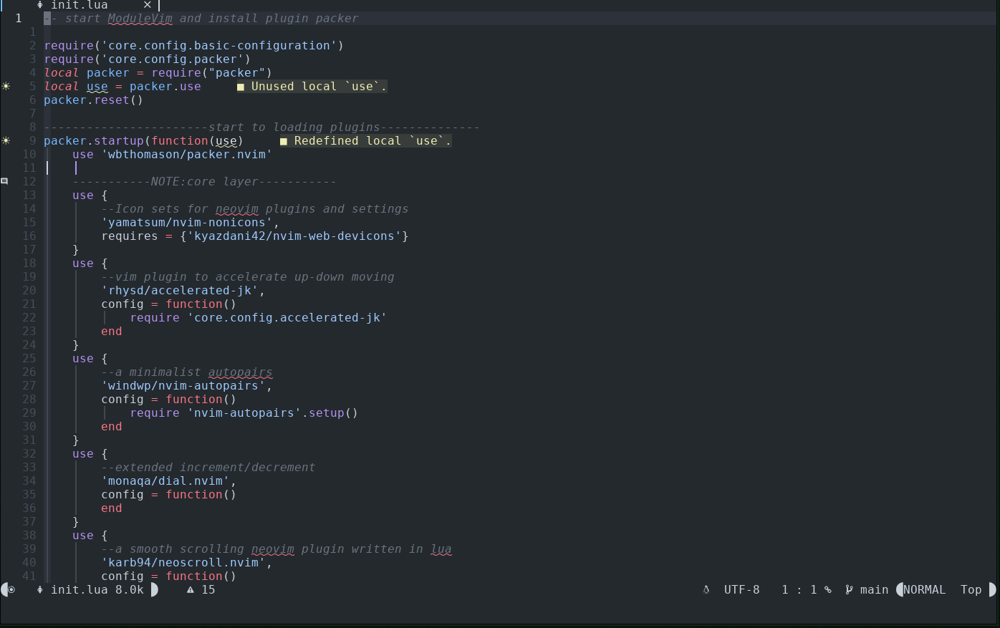

# ModuleVim
A NeoVim configuration with original LSP support([lspconfig](https://github.com/neovim/nvim-lspconfig)) and some
fashion plugins

## snippets
gruvybox theme

github theme

which-key

transparent style


## features
- key hint.(support by [which-key]() )
- easily change colorscheme(`SPC-t-c`)
- lazy load


## plugin table

| function | plugin |
|--------------- | --------------- |
| statusline | galaxyline |
| tabline | barbar |
| file tree | nvim-tree |
| tags | vista |
| welcome page | dashboard-nvim |
| fuzzy finder | telescope |
| terminal support | nvim-toggleterm |


## support languages
For now, ModuleVim supports some common used languages, you can also add
language by `:LspInstall $language`

## use

copy modulevim dictionary into your config path and then

```
ln -s modulevim ~/.config/nvim
```
have fun
